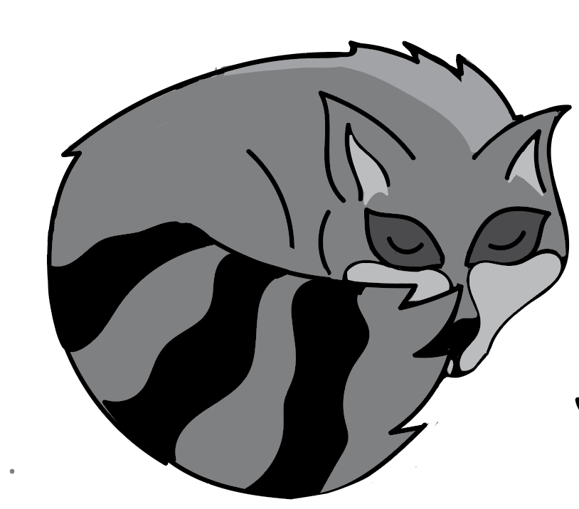
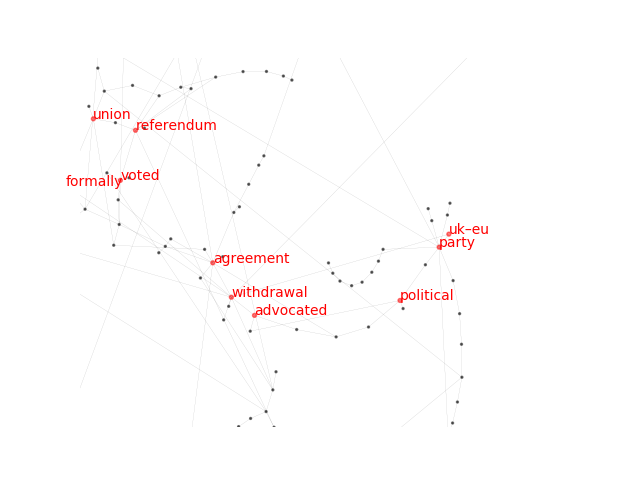
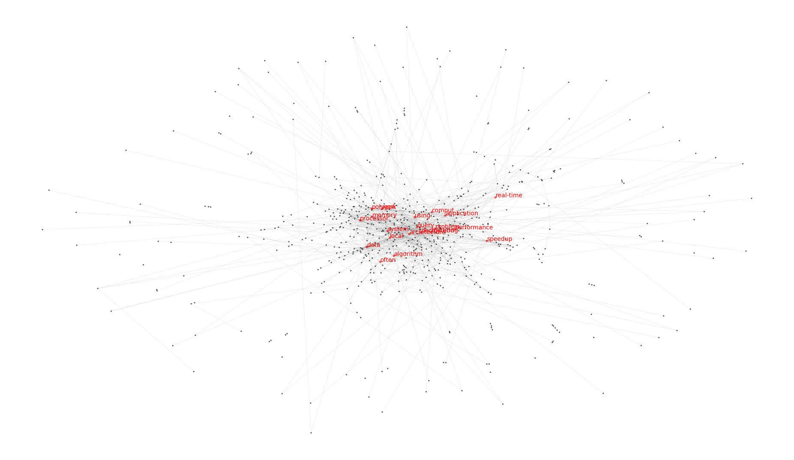
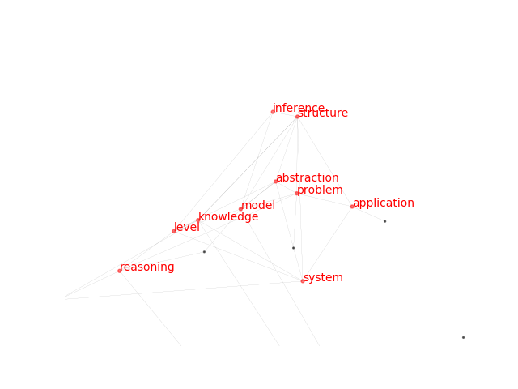

# RaKUn algorithm


This is the official repository of RaKUn. This keyword detection algorithm exploits graph-based language representations for efficient denoising and keyword detection.
Key ideas of RaKUn:

1. Transform texts to graphs
2. Prune graphs based on token similarity (meta vertex introduction)
3. Rank nodes -> keywords

This repo now also includes extensive evaluation functionality, which can be of use to the community.

## An update
Since RaKUn's release, we have conducted more extensive empirical evaluation against even stronger baselines. The most recent results can be found here:
https://www.cambridge.org/core/journals/natural-language-engineering/article/tntkid-transformerbased-neural-tagger-for-keyword-identification/A41C8B12C1F3F4F02BF839FCAFA1A695

*spoiler alert*: at P@5, RaKUn performs amongst the best and at P@10 it is insignificantly different to others, albeit a bit worse. Supervised methods, however, dominate.

## A note
RaKUn is extremely crude, and thus one of the fastest methods. To achieve sota performance, grid search across the hyperparameter space is suggested, as the parameters can vary a lot w.r.t. domain of the application.

## The core functionality
Packed as a Python library, it can be installed via:

```
pip3 install mrakun
```

or

```
python3 setup.py install
```

## Requirements
To install the required libraries, we suggest:
```
pip3 install -r requirements.txt
```
For visualization, one also needs Py3plex library (>=0.66). (**pip3 install py3plex**)

## Tests
To test whether the core functionality is ok, you can run
```
python3 -m pytest tests/test_core_functionality.py
```

Note that you need Py3plex library for both tests to pass!

## Usage with editdistance
Using RaKUn is simple! Simply call the main detector method with optional arguments (as described in the paper)

Let's as the first example consider a text block from the Wiki about Brexit.

```python
from mrakun import RakunDetector
from nltk.corpus import stopwords


blob_of_text = "Brexit (/ˈbrɛksɪt, ˈbrɛɡzɪt/;[1] a portmanteau of \"British\" and \"exit\") is the scheduled withdrawal of the United Kingdom (UK) from the European Union (EU). Following a June 2016 referendum, in which 51.9% voted to leave, the UK government formally announced the country's withdrawal in March 2017, starting a two-year process that was due to conclude with the UK withdrawing on 29 March 2019. As the UK parliament thrice voted against the negotiated withdrawal agreement, that deadline has been extended twice, and is currently 31 October 2019.[2][3] An Act of Parliament requires the government to seek a third extension if no agreement is reached before 19 October. Withdrawal is advocated by Eurosceptics and opposed by pro-Europeanists, both of whom span the political spectrum. The UK joined the European Communities (EC) in 1973, with continued membership endorsed in a 1975 referendum. In the 1970s and 1980s, withdrawal from the EC was advocated mainly by the political left, e.g. in the Labour Party's 1983 election manifesto. From the 1990s, the eurosceptic wing of the Conservative Party grew, and led a rebellion over ratification of the 1992 Maastricht Treaty that established the EU. In parallel with the UK Independence Party (UKIP), and the cross-party People's Pledge campaign, it pressured Conservative Prime Minister David Cameron to hold a referendum on continued EU membership. Cameron, who had campaigned to remain, resigned after the result and was succeeded by Theresa May. On 29 March 2017, the UK government invoked Article 50 of the Treaty on European Union, formally starting the withdrawal. May called a snap general election in June 2017, which resulted in a Conservative minority government supported by the Democratic Unionist Party. UK–EU withdrawal negotiations began later that month. The UK negotiated to leave the EU customs union and single market. This resulted in the November 2018 withdrawal agreement, but the UK parliament voted against ratifying it three times. The Labour Party wanted any agreement to maintain a customs union, while many Conservatives opposed the agreement's financial settlement on the UK's share of EU financial obligations, as well as the Irish backstop designed to prevent border controls in Ireland. The Liberal Democrats, Scottish National Party and others seek to reverse Brexit through a second referendum. The EU has declined a re-negotiation that omits the backstop. In March 2019, the UK parliament voted for May to ask the EU to delay Brexit until October. Having failed to pass her agreement, May resigned as Prime Minister in July and was succeeded by Boris Johnson. He sought to replace parts of the agreement and vowed to leave the EU by the new deadline, with or without an agreement."

hyperparameters = {"distance_threshold":2,
                   "distance_method": "editdistance",
                   "num_keywords" : 10,
                   "pair_diff_length":2,
                   "stopwords" : stopwords.words('english'),
                   "bigram_count_threshold":2,
                   "num_tokens":[1,2],
		   "max_similar" : 3, ## n most similar can show up n times
		   "max_occurrence" : 3} ## maximum frequency overall

keyword_detector = RakunDetector(hyperparameters)
keywords = keyword_detector.find_keywords(blob_of_text, input_type = "text")
print(keywords)
keyword_detector.visualize_network()

```
The keywords identified are:

```
[('withdrawal', 0.24997620407386256), ('party', 0.1800875690081858), ('agreement', 0.1702598515134209), ('voted', 0.12316771368741672), ('advocated', 0.10108509423186751), ('referendum', 0.08980582524271845), ('political', 0.08756900818579859), ('formally', 0.08614125261755187), ('union', 0.08457072149248049), ('uk–eu', 0.08397582333904435)]
```

Visualized as:



Other use:
```python
from mrakun import RakunDetector
from nltk.corpus import stopwords

hyperparameters = {"distance_threshold":3,
                   "num_keywords" : 10,
                   "distance_method": "editdistance",
                   "pair_diff_length":2,
                   "stopwords" : stopwords.words('english'),
                   "bigram_count_threshold":2,
                   "num_tokens":[1]}

keyword_detector = RakunDetector(hyperparameters)
example_data = "./datasets/wiki20/docsutf8/7183.txt"
keywords = keyword_detector.find_keywords(example_data)
print(keywords)

keyword_detector.verbose = False

```
Two results are returned. First one are keywords with corresponding centrality scores, e.g.,

```
[('knowledge', 0.09681271338743186), ('system', 0.07564796507791872), ('level', 0.05109912821797258), ('model', 0.04258209551663402), ('domain', 0.04148756282878477), ('task', 0.03965601439030798), ('structure', 0.03819960122342131), ('1989', 0.03287462707574183), ('diagnosis', 0.03236736673125384), ('method', 0.030969444684564095)]
```

And the plot of the keyword graph:

```python
## once the find_keywords() was invoked
keyword_detector.visualize_network()
```



## Hyperparameter explanation

Consider the following hyperparameters:
```
hyperparameters = {"distance_threshold":3,
                   "num_keywords" : 10,
                   "distance_method": "editdistance",
                   "pair_diff_length":2,
                   "stopwords" : stopwords.words('english'),
                   "bigram_count_threshold":2,
                   "num_tokens":[1],
		   "max_similar": 2,
		   "max_occurrence": 2}
```


| Hyperparameter     | Description                                                                                                                                                                                             |
|--------------------|----------------------------------------------------------------------------------------------------------------------------------------------------------------------------------------------------------------|
| distance_threshold | Distance between  tokens that initiates the merge process (if more similar than this, the tokens are merged)                                                                                                   |
| num_keywords       | The number of keywords to be detected                                                                                                                                                                          |
| pair_diff_length   | If the difference in the length of the two tokens is smaller than this parameter, the tokens are considered for merging.                                                                                       |
| num_tokens         | The number of tokens that can constitute a keyword (1,2 or 3). This is a list, as e.g., [1,2] implies tokens of length 1 as well as pairs of tokens are considered as keywords.                                |
| max_similar        | How many similar keywords are permitted. For example, "british vote" and "british parliament" would  be considered similar (overlap of at least one token). This way, too similar keywords can be prunned out. |
| max_occurrence     | How many of the most common keywords are to be considered during max_similar prunning step. Intuitively, only a handful of keywords are worthy of prunning out if appearing too much (e.g., "parliament").     |
| lemmatizer | The e.g., NLTK lemmatizer instance -> this lemmatizes tokens during graph construction.

## Usage with fasttext
Using RaKUn with fasttext requires pretrained emmbeding model. Download .bin file from https://github.com/facebookresearch/fastText/blob/master/docs/pretrained-vectors.md for chosen language and save it.

```python
from mrakun import RakunDetector
from nltk.corpus import stopwords

hyperparameters = {"distance_threshold":0.2,
                   "distance_method": "fasttext",
                   "pretrained_embedding_path": '../pretrained_models/fasttext/wiki.en.bin', #change path accordingly
                   "num_keywords" : 10,
                   "pair_diff_length":2,
                   "stopwords" : stopwords.words('english'),
                   "bigram_count_threshold":2,
                   "num_tokens":[1]}

keyword_detector = RakunDetector(hyperparameters)
example_data = "./datasets/wiki20/docsutf8/7183.txt"
keywords = keyword_detector.find_keywords(example_data)
print(keywords)

keyword_detector.verbose = False
```
Two results are returned. First one are keywords with corresponding centrality scores, e.g.,

```
[('structure', 0.013043478260869565), ('model', 0.010507246376811594), ('level', 0.009420289855072464), ('knowledge', 0.006400966183574879), ('system', 0.005595813204508856), ('application', 0.004589371980676328), ('inference', 0.002657004830917874), ('reasoning', 0.002536231884057971), ('abstraction', 0.0020933977455716585), ('problem', 0.0020933977455716585)]
```

And the plot of the keyword graph:

```python
## once the find_keywords() was invoked
keyword_detector.visualize_network()
```




## Acknowledgements
The logo was created by Luka Skrlj

# Citation
```
@InProceedings{10.1007/978-3-030-31372-2_26,
author="{\v{S}}krlj, Bla{\v{z}}
and Repar, Andra{\v{z}}
and Pollak, Senja",
editor="Mart{\'i}n-Vide, Carlos
and Purver, Matthew
and Pollak, Senja",
title="RaKUn: Rank-based Keyword Extraction via Unsupervised Learning and Meta Vertex Aggregation",
booktitle="Statistical Language and Speech Processing",
year="2019",
publisher="Springer International Publishing",
address="Cham",
pages="311--323",
abstract="Keyword extraction is used for summarizing the content of a document and supports efficient document retrieval, and is as such an indispensable part of modern text-based systems. We explore how load centrality, a graph-theoretic measure applied to graphs derived from a given text can be used to efficiently identify and rank keywords. Introducing meta vertices (aggregates of existing vertices) and systematic redundancy filters, the proposed method performs on par with state-of-the-art for the keyword extraction task on 14 diverse datasets. The proposed method is unsupervised, interpretable and can also be used for document visualization.",
isbn="978-3-030-31372-2"
}

```